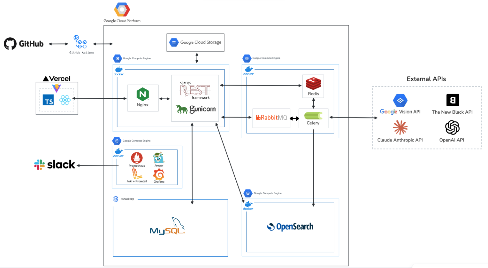
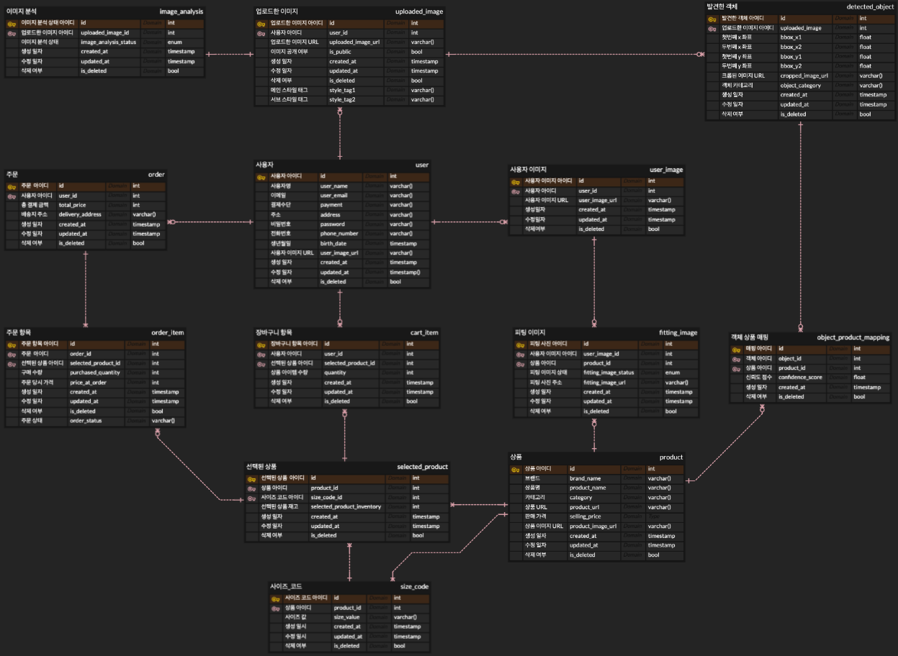
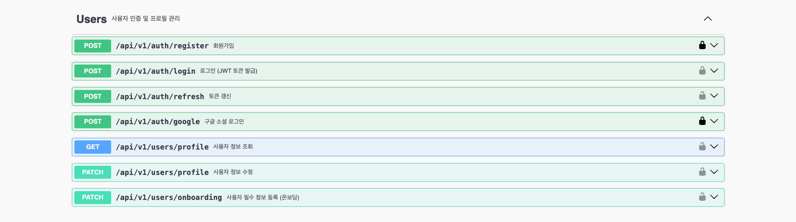
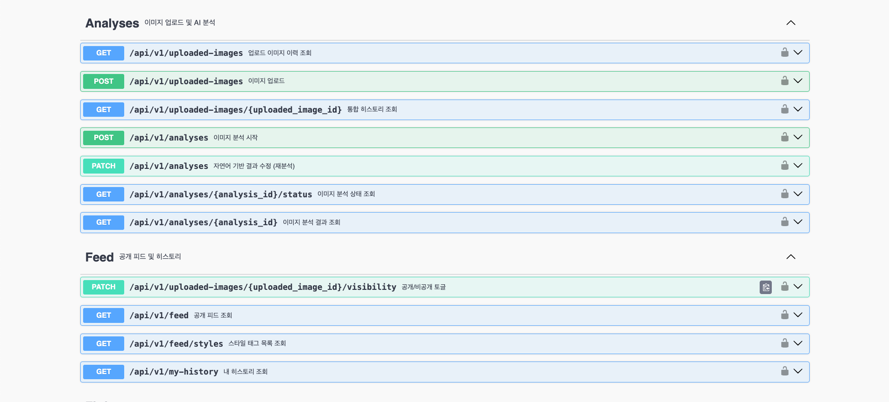
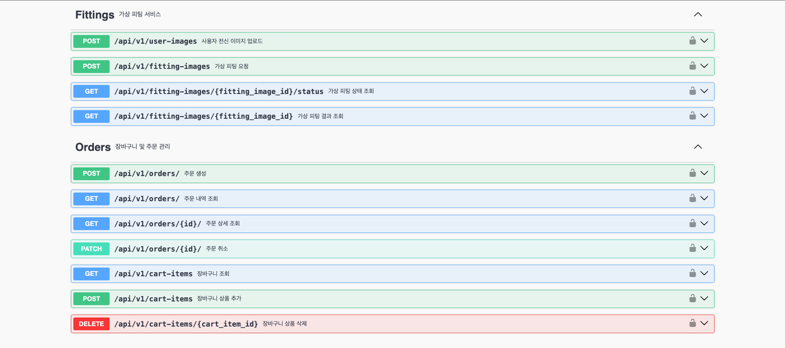
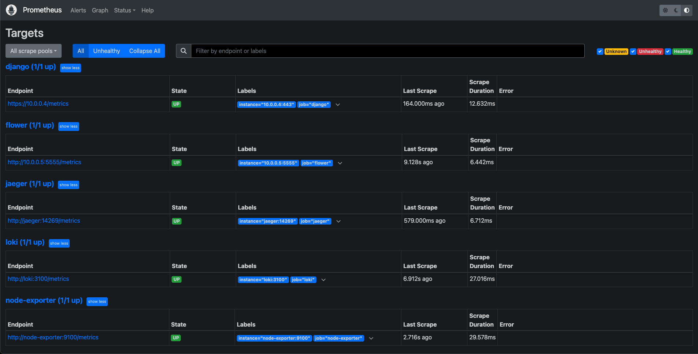
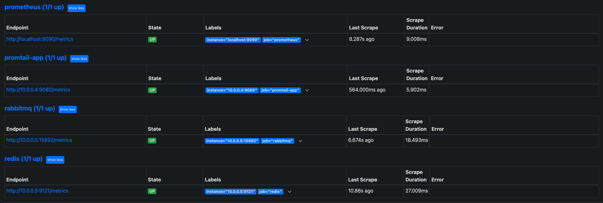
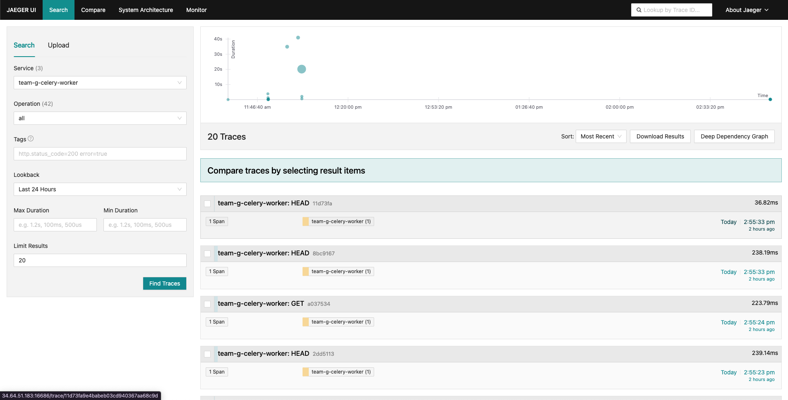

<p align="center">
  
</p>

<h1 align="center">DRESSENSE</h1>

<p align="center">
  <strong>AI 기반 패션 이미지 검색 & 가상 피팅 플랫폼</strong><br/>
  <sub>사진 한 장으로 원하는 옷 찾고, 입어보고, 구매까지</sub>
</p>

<p align="center">
  
  
  
  
</p>

<p align="center">
  <a href="#-introduction">Introduction</a> •
  <a href="#-demo">Demo</a> •
  <a href="#-architecture">Architecture</a> •
  <a href="#-tech-stack">Tech Stack</a> •
  <a href="#-monitoring">Monitoring</a> •
  <a href="#-getting-started">Getting Started</a> •
  <a href="#-team">Team</a>
</p>

---

# 📣 Introduction

<p align="center">

</p>

## URL
> https://www.dressense.store/

## MEDIUM
> https://medium.com/p/817132d67ecb/edit

# 🎬 Demo

## 메인 페이지
> 개인 및 전체 사용자 피드를 조회하고, 기존에 분석한 결과를 참조할 수 있습니다.
<p align="center">

</p>

## AI 이미지 분석
> 업로드한 이미지에서 패션 아이템을 자동으로 감지하고 유사 상품을 검색합니다.
<p align="center">

</p>

## 가상 피팅
> 원하는 옷을 선택하면 AI가 내 모습에 가상으로 입혀줍니다.

<p align="center">

</p>

## AI 채팅 어시스턴트
> "이 옷이랑 어울리는 바지 찾아줘", "이거 입어볼래" 같은 자연어 명령을 지원합니다.

<p align="center">

</p>

# 🏗 System Architecture


# 🔑 ERD


# 📗 API Documentation






# 💻 Tech Stack

<table>
  <tr>
    <th width="140">Category</th>
    <th>Technologies</th>
  </tr>
  <tr>
    <td align="center"><b>Backend</b></td>
    <td>
      
      
      
      
      
    </td>
  </tr>
  <tr>
    <td align="center"><b>AI / ML</b></td>
    <td>
      
      
      
      
      
    </td>
  </tr>
  <tr>
    <td align="center"><b>Database</b></td>
    <td>
      
      
      
    </td>
  </tr>
  <tr>
    <td align="center"><b>Message Queue</b></td>
    <td>
      
      
    </td>
  </tr>
  <tr>
    <td align="center"><b>Infrastructure</b></td>
    <td>
      
      
      
      
    </td>
  </tr>
  <tr>
    <td align="center"><b>Monitoring</b></td>
    <td>
      
      
      
      
    </td>
  </tr>
  <tr>
    <td align="center"><b>Virtual Fitting</b></td>
    <td>
      
      
    </td>
  </tr>
  <tr>
    <td align="center"><b>Collaboration</b></td>
    <td>
      
      
      
      
    </td>
  </tr>
</table>

# 📊 Monitoring
## Grafana Dashboard (Loki)


### **주요 지표:**
- Total Requests (24h) - 일일 총 요청 수
- 2xx / 4xx / 5xx - HTTP 상태 코드별 요청 수
- Total Logs Size - 로그 수집량
- Requests by Status Code - 시간대별 요청 추이

## Prometheus Targets



### **수집 대상 (9개 서비스):**
- `django` - Django 애플리케이션
- `flower` - Celery 모니터링
- `jaeger` - 분산 트레이싱
- `loki` - 로그 수집
- `node-exporter` - 시스템 메트릭
- `prometheus` - 메트릭 서버
- `promtail-app` - 로그 전송
- `rabbitmq` - 메시지 큐
- `redis` - 캐시/세션

## Distributed Tracing (Jaeger)



### **트레이스 분석:**
- API 요청부터 응답까지 전체 흐름 시각화
- Celery 워커 태스크 실행 시간 측정
- 병목 구간 식별 및 성능 최적화

# 🚀 Getting Started

## Prerequisites
- Python 3.11.8 (pyenv 권장)
- Docker & Docker Compose
- GCP Account (Cloud SQL, GCS, Compute Engine)

## 1. Clone Repository
```bash
git clone https://github.com/Techeer-11-team-g/Team_G_Backend.git
git clone https://github.com/Techeer-11-team-g/Team_G_Frontend.git
```

## 2. Environment Setup
```bash
cd Team_G_Backend
cp .env.example .env
# Edit .env with your API keys and credentials
```

<details>
<summary><b>📋 Required Environment Variables</b></summary>

```bash
# Django
SECRET_KEY=your-secret-key
DEBUG=False

# Database
DB_NAME=team_g_db
DB_USER=your-db-user
DB_PASSWORD=your-db-password
DB_HOST=your-cloud-sql-ip

# Redis & RabbitMQ
REDIS_HOST=your-queue-server-ip
RABBITMQ_HOST=your-queue-server-ip

# AI Services
OPENAI_API_KEY=sk-xxxxx
ANTHROPIC_API_KEY=sk-ant-xxxxx
GOOGLE_APPLICATION_CREDENTIALS=/path/to/credentials.json

# Virtual Fitting
FASHN_API_KEY=your-fashn-key

# Storage
GCS_BUCKET_NAME=your-bucket
GCS_PROJECT_ID=your-project-id

# Observability
JAEGER_HOST=your-monitoring-server-ip
LOKI_URL=http://your-monitoring-server-ip:3100/loki/api/v1/push
```
</details>

## 3. Run with Docker
```bash
docker-compose up -d
docker-compose exec web python manage.py migrate
docker-compose exec web python manage.py createsuperuser
```

## 4. Run Locally (Development)
```bash
# Python 환경 설정
pyenv install 3.11.8
pyenv local 3.11.8
python -m venv venv
source venv/bin/activate

# 의존성 설치
pip install -r requirements.txt

# 서버 실행
python manage.py runserver

# Celery Worker (별도 터미널)
celery -A config worker -l info
```

# 👥 Team

<table>
  <tr>
    <td align="center" width="150">
      <a href="https://github.com/jungwon123">
        <br/>
        <sub><b>이정원</b></sub>
      </a><br/>
      <sub>Team Leader</sub><br/>
      <sub>Frontend, Backend</sub>
    </td>
    <td align="center" width="150">
      <a href="https://github.com/Pionia5375">
        <br/>
        <sub><b>이정</b></sub>
      </a><br/>
      <sub>Team Member</sub><br/>
      <sub>Backend, DevOps</sub>
    </td>
    <td align="center" width="150">
      <a href="https://github.com/yoonchaerin">
        <br/>
        <sub><b>윤채린</b></sub>
      </a><br/>
      <sub>Team Member</sub><br/>
      <sub>Backend</sub>
    </td>
    <td align="center" width="150">
      <a href="https://github.com/kyuho11488/kyuho11488.git">
        <br/>
        <sub><b>이규호</b></sub>
      </a><br/>
      <sub>Team Member</sub><br/>
      <sub>Backend</sub>
    </td>
    <td align="center" width="150">
      <a href="https://github.com/c0ding01seo-tech">
        <br/>
        <sub><b>노연서</b></sub>
      </a><br/>
      <sub>Team Member</sub><br/>
      <sub>Backend</sub>
    </td>
  </tr>
</table>

<br/>

---

<p align="center">
  <sub>Built with by Team G | Techeer 11th</sub>
</p>
