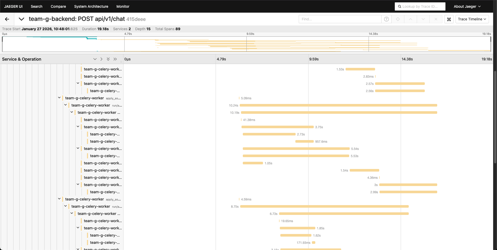
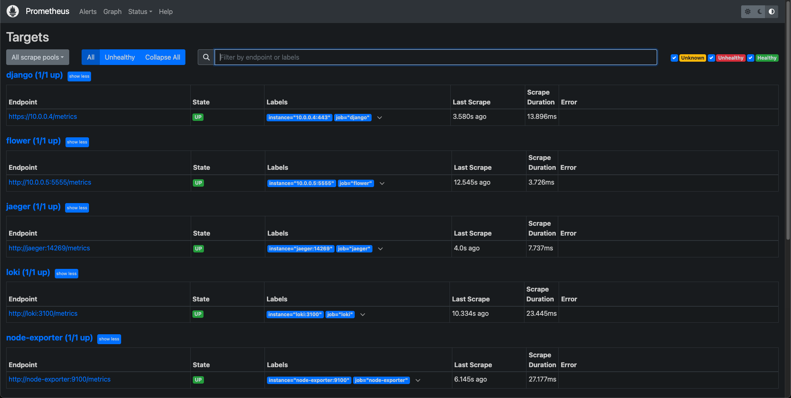
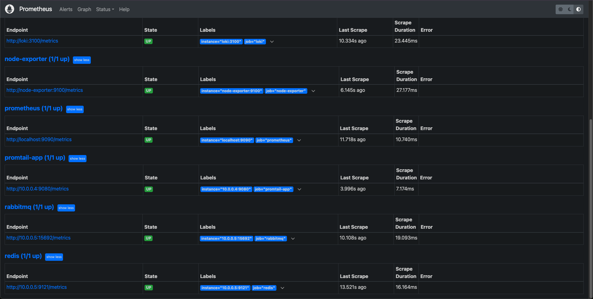

<p align="center">
  
</p>

<h1 align="center">DRESSENSE</h1>

<p align="center">
  <strong>AI 기반 패션 이미지 검색 & 가상 피팅 플랫폼</strong><br/>
  <sub>사진 한 장으로 원하는 옷 찾고, 입어보고, 구매까지</sub>
</p>

<p align="center">
  
  
  
  
</p>

<p align="center">
  <a href="#-introduction">Introduction</a> •
  <a href="#-demo">Demo</a> •
  <a href="#-architecture">Architecture</a> •
  <a href="#-tech-stack">Tech Stack</a> •
  <a href="#-monitoring">Monitoring</a> •
  <a href="#-getting-started">Getting Started</a> •
  <a href="#-team">Team</a>
</p>

---

## 📣 Introduction

> 길거리에서 본 옷, SNS에서 스쳐간 코디...
> "이 옷 어디서 살 수 있지?" 더 이상 고민하지 마세요.

**DRESSENSE**는 이미지 한 장으로 패션 아이템을 검색하고, AI 가상 피팅으로 미리 입어본 뒤, 바로 구매할 수 있는 올인원 패션 플랫폼입니다.

### 주요 기능

| 기능 | 설명 |
|:---:|:---|
| 🔍 **AI 이미지 검색** | 사진 속 패션 아이템을 자동 인식하고 유사 상품 검색 |
| 👗 **가상 피팅** | 선택한 옷을 내 사진에 입혀보는 AI 가상 피팅 |
| 💬 **AI 쇼핑 어시스턴트** | 자연어로 상품 검색, 추천, 피팅 요청 |
| 🛒 **원터치 구매** | 검색부터 결제까지 끊김 없는 쇼핑 경험 |

<br/>

## 🎬 Demo

### 메인 페이지
<!-- TODO: 메인페이지 GIF 추가 -->


### AI 이미지 분석
> 업로드한 이미지에서 패션 아이템을 자동으로 감지하고 유사 상품을 검색합니다.

<!-- TODO: 이미지 분석 데모 GIF 추가 -->


### 가상 피팅
> 원하는 옷을 선택하면 AI가 내 모습에 가상으로 입혀줍니다.

<!-- TODO: 가상 피팅 데모 GIF 추가 -->


### AI 채팅 어시스턴트
> "이 옷이랑 어울리는 바지 찾아줘", "이거 입어볼래" 같은 자연어 명령 지원

<!-- TODO: 채팅 데모 GIF 추가 -->


## 🏗 System Architecture


## 🔑 ERD


## 📗 API Documentation


## 💻 Tech Stack

<table>
  <tr>
    <th width="140">Category</th>
    <th>Technologies</th>
  </tr>
  <tr>
    <td align="center"><b>Backend</b></td>
    <td>
      
      
      
      
      
    </td>
  </tr>
  <tr>
    <td align="center"><b>AI / ML</b></td>
    <td>
      
      
      
      
      
    </td>
  </tr>
  <tr>
    <td align="center"><b>Database</b></td>
    <td>
      
      
      
    </td>
  </tr>
  <tr>
    <td align="center"><b>Message Queue</b></td>
    <td>
      
      
    </td>
  </tr>
  <tr>
    <td align="center"><b>Infrastructure</b></td>
    <td>
      
      
      
      
    </td>
  </tr>
  <tr>
    <td align="center"><b>Monitoring</b></td>
    <td>
      
      
      
      
    </td>
  </tr>
  <tr>
    <td align="center"><b>Virtual Fitting</b></td>
    <td>
      
      
    </td>
  </tr>
  <tr>
    <td align="center"><b>Collaboration</b></td>
    <td>
      
      
      
      
    </td>
  </tr>
</table>

## 📊 Monitoring

### Distributed Tracing (Jaeger)
> 분석 파이프라인 각 단계별 소요 시간을 추적합니다.



### Message Queue (RabbitMQ)


### Logging (Loki & Promtail)


## 🚀 Getting Started

### Prerequisites
- Python 3.11.8 (pyenv 권장)
- Docker & Docker Compose
- GCP Account (Cloud SQL, GCS, Compute Engine)

### 1. Clone Repository
```bash
git clone https://github.com/Techeer-11-team-g/Team_G_Backend.git
git clone https://github.com/Techeer-11-team-g/Team_G_Frontend.git
```

### 2. Environment Setup
```bash
cd Team_G_Backend
cp .env.example .env
# Edit .env with your API keys and credentials
```

<details>
<summary><b>📋 Required Environment Variables</b></summary>

```bash
# Django
SECRET_KEY=your-secret-key
DEBUG=False

# Database
DB_NAME=team_g_db
DB_USER=your-db-user
DB_PASSWORD=your-db-password
DB_HOST=your-cloud-sql-ip

# Redis & RabbitMQ
REDIS_HOST=your-queue-server-ip
RABBITMQ_HOST=your-queue-server-ip

# AI Services
OPENAI_API_KEY=sk-xxxxx
ANTHROPIC_API_KEY=sk-ant-xxxxx
GOOGLE_APPLICATION_CREDENTIALS=/path/to/credentials.json

# Virtual Fitting
FASHN_API_KEY=your-fashn-key

# Storage
GCS_BUCKET_NAME=your-bucket
GCS_PROJECT_ID=your-project-id

# Observability
JAEGER_HOST=your-monitoring-server-ip
LOKI_URL=http://your-monitoring-server-ip:3100/loki/api/v1/push
```
</details>

### 3. Run with Docker
```bash
docker-compose up -d
docker-compose exec web python manage.py migrate
docker-compose exec web python manage.py createsuperuser
```

### 4. Run Locally (Development)
```bash
# Python 환경 설정
pyenv install 3.11.8
pyenv local 3.11.8
python -m venv venv
source venv/bin/activate

# 의존성 설치
pip install -r requirements.txt

# 서버 실행
python manage.py runserver

# Celery Worker (별도 터미널)
celery -A config worker -l info
```

## 👥 Team

<table>
  <tr>
    <td align="center" width="150">
      <a href="https://github.com/username1">
        <br/>
        <sub><b>팀원1</b></sub>
      </a><br/>
      <sub>Team Leader</sub><br/>
      <sub>Backend, DevOps</sub>
    </td>
    <td align="center" width="150">
      <a href="https://github.com/username2">
        <br/>
        <sub><b>팀원2</b></sub>
      </a><br/>
      <sub>Backend</sub><br/>
      <sub>AI Pipeline</sub>
    </td>
    <td align="center" width="150">
      <a href="https://github.com/username3">
        <br/>
        <sub><b>팀원3</b></sub>
      </a><br/>
      <sub>Backend</sub><br/>
      <sub>Search & DB</sub>
    </td>
    <td align="center" width="150">
      <a href="https://github.com/username4">
        <br/>
        <sub><b>팀원4</b></sub>
      </a><br/>
      <sub>Frontend</sub><br/>
      <sub>UI/UX</sub>
    </td>
    <td align="center" width="150">
      <a href="https://github.com/username5">
        <br/>
        <sub><b>팀원5</b></sub>
      </a><br/>
      <sub>Frontend</sub><br/>
      <sub>Design</sub>
    </td>
  </tr>
</table>

<br/>

---

<p align="center">
  <sub>Built with by Team G | Techeer 11th</sub>
</p>
